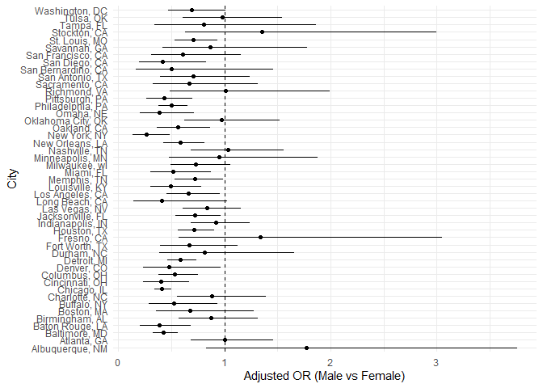
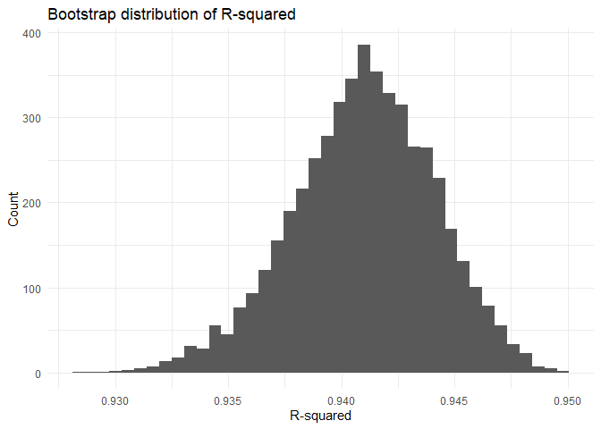
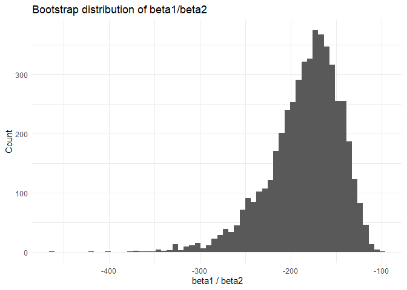
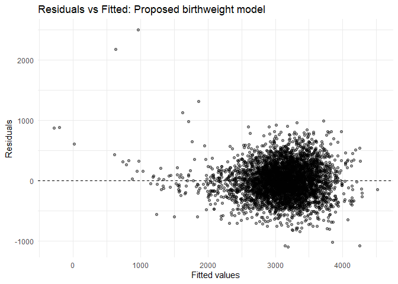

p8105_hw6_cd3591
================
Anny
2025-11-28

``` r
# set up libraries
library(tidyverse)
```

    ## ── Attaching core tidyverse packages ──────────────────────── tidyverse 2.0.0 ──
    ## ✔ dplyr     1.1.4     ✔ readr     2.1.5
    ## ✔ forcats   1.0.0     ✔ stringr   1.5.1
    ## ✔ ggplot2   3.5.2     ✔ tibble    3.3.0
    ## ✔ lubridate 1.9.4     ✔ tidyr     1.3.1
    ## ✔ purrr     1.1.0     
    ## ── Conflicts ────────────────────────────────────────── tidyverse_conflicts() ──
    ## ✖ dplyr::filter() masks stats::filter()
    ## ✖ dplyr::lag()    masks stats::lag()
    ## ℹ Use the conflicted package (<http://conflicted.r-lib.org/>) to force all conflicts to become errors

# Problem 1

``` r
# import the dataset
homicides_raw = read_csv("homicide-data.csv") %>% 
  janitor::clean_names()
```

    ## Rows: 52179 Columns: 12
    ## ── Column specification ────────────────────────────────────────────────────────
    ## Delimiter: ","
    ## chr (9): uid, victim_last, victim_first, victim_race, victim_age, victim_sex...
    ## dbl (3): reported_date, lat, lon
    ## 
    ## ℹ Use `spec()` to retrieve the full column specification for this data.
    ## ℹ Specify the column types or set `show_col_types = FALSE` to quiet this message.

``` r
# tidy the dataset
homicides = homicides_raw %>%
  mutate(
    city_state = str_c(city, ", ", state),  # e.g. “Baltimore, MD”
    resolved = ifelse(disposition == "Closed by arrest", 1, 0),  # 1 means homicide is solved, 0 means it is not (binary)
    victim_age = as.numeric(victim_age)  # Be sure that victim_age is numeric
  ) %>%
  filter(
    !city_state %in% c("Dallas, TX", "Phoenix, AZ", "Kansas City, MO", "Tulsa, AL"),  
    # Omit cities Dallas, TX; Phoenix, AZ; and Kansas City, MO, Tulsa, AL
    victim_race %in% c("White", "Black"),  # limit your analysis those for whom victim_race is white or black
    !is.na(victim_age)
  ) %>%
  mutate(
    victim_sex = relevel(factor(victim_sex), ref = "Female"),  # make the reference level is female in victim_sex
    victim_race = relevel(factor(victim_race), ref = "White")  # make the reference level is white in victim_race
  )
```

    ## Warning: There was 1 warning in `mutate()`.
    ## ℹ In argument: `victim_age = as.numeric(victim_age)`.
    ## Caused by warning:
    ## ! NAs introduced by coercion

``` r
# Baltimore only: OR + CI for male vs female
baltimore_fit = homicides %>%
  filter(city_state == "Baltimore, MD") %>%
  glm(resolved ~ victim_age + victim_sex + victim_race, data = ., family = binomial())

baltimore_or =
  broom::tidy(baltimore_fit, exponentiate = TRUE, conf.int = TRUE) %>%
  filter(term == "victim_sexMale") %>%
  select(estimate, conf.low, conf.high)

baltimore_or
```

    ## # A tibble: 1 × 3
    ##   estimate conf.low conf.high
    ##      <dbl>    <dbl>     <dbl>
    ## 1    0.426    0.324     0.558

The estimate of the ajusted OR is 0.4255117, with the confidence
interval of (0.3241908, 0.5575508).

``` r
# run each city
city_or = homicides %>%
  group_by(city_state) %>%
  nest() %>%
  mutate(
    fit = purrr::map(
      data,
      possibly(
        ~ suppressWarnings(glm(resolved ~ victim_age + victim_sex + victim_race,
              data = .x, family = binomial())),
        otherwise = NULL
      )
    ),
    tidied = purrr::map(
      fit,
      ~ if (is.null(.x)) NULL else suppressWarnings(broom::tidy(.x, exponentiate = TRUE, conf.int = TRUE))
    )
  ) %>%
  select(city_state, tidied) %>%
  filter(!map_lgl(tidied, is.null)) %>%      # drop cities where glm failed
  unnest(tidied) %>%
  filter(term == "victim_sexMale") %>%
  transmute(
    city_state,
    or = estimate,
    ci_low = conf.low,
    ci_high = conf.high
  ) %>%
  mutate(city_state = fct_reorder(city_state, or))

city_or
```

    ## # A tibble: 47 × 4
    ## # Groups:   city_state [47]
    ##    city_state         or ci_low ci_high
    ##    <fct>           <dbl>  <dbl>   <dbl>
    ##  1 Albuquerque, NM 1.77   0.825   3.76 
    ##  2 Atlanta, GA     1.00   0.680   1.46 
    ##  3 Baltimore, MD   0.426  0.324   0.558
    ##  4 Baton Rouge, LA 0.381  0.204   0.684
    ##  5 Birmingham, AL  0.870  0.571   1.31 
    ##  6 Boston, MA      0.674  0.353   1.28 
    ##  7 Buffalo, NY     0.521  0.288   0.936
    ##  8 Charlotte, NC   0.884  0.551   1.39 
    ##  9 Chicago, IL     0.410  0.336   0.501
    ## 10 Cincinnati, OH  0.400  0.231   0.667
    ## # ℹ 37 more rows

``` r
# plot the graph of the estimated ORs and CIs for each city
ggplot(city_or, aes(x = city_state, y = or)) +
  geom_point() +
  geom_errorbar(aes(ymin = ci_low, ymax = ci_high), width = 0) +
  geom_hline(yintercept = 1, linetype = 2) +
  coord_flip() +
  theme_minimal() +
  labs(x = "City", y = "Adjusted OR (Male vs Female)")
```

<!-- -->

Across most cities, the adjusted odds ratio (male vs. female) is
below 1. This suggests that, after adjusting for victim age and race,
homicides with male victims generally have lower odds of being solved
than homicides with female victims.

A smaller number of cities have point estimates near 1 (or slightly
above 1), indicating little difference by victim sex or a possible
reversal in direction. However, many of these estimates have confidence
intervals that cross 1, so the evidence for a clear sex difference in
those cities is weak or inconclusive.

Finally, a few cities show very wide confidence intervals and/or
unusually large odds ratios (e.g., the extreme value near the bottom of
the plot). These patterns usually reflect limited data within that city
complete separation in the logistic regression, which makes estimates
unstable. As a result, those extreme city-specific estimates should be
interpreted cautiously compared with the more precise estimates.

# Problem 2

``` r
# get the weather_df
library(p8105.datasets)
data("weather_df")
```

``` r
set.seed(1122)

# write the function for bootstrap
bootstrap = function(df) {
  boot_df = df %>% slice_sample(n = nrow(df), replace = TRUE)

  fit = lm(tmax ~ tmin + prcp, data = boot_df)

  r2 = broom::glance(fit)$r.squared

  coefs = broom::tidy(fit)
  b1 = coefs %>% filter(term == "tmin") %>% pull(estimate)
  b2 = coefs %>% filter(term == "prcp") %>% pull(estimate)

  tibble(r2 = r2, beta1_over_beta2 = b1 / b2)
}

# 5000 bootstrap replicates
boot_results = map_dfr(1:5000, ~ bootstrap(weather_df))
```

``` r
# r^2 distribution
ggplot(boot_results, aes(x = r2)) +
  geom_histogram(bins = 40) +
  theme_minimal() +
  labs(title = "Bootstrap distribution of R-squared", x = "R-squared", y = "Count")
```

<!-- -->

The bootstrap distribution of R_squared is unimodal, roughly bell-shaped
and fairly narrow, centered around about 0.94. This indicates the model
fit is very stable across bootstrap resamples: in almost every resample,
the regression of tmax on tmin and prcp explains a very similar
proportion of the variability in tmax (roughly 93%–95%).

``` r
# beta1/beta2 distribution (can be extreme if beta2 is near 0)
ggplot(boot_results, aes(x = beta1_over_beta2)) +
  geom_histogram(bins = 60) +
  theme_minimal() +
  labs(title = "Bootstrap distribution of beta1/beta2", x = "beta1 / beta2", y = "Count")
```

<!-- -->

The bootstrap distribution of b1/b2 is unimodal, much wider and clearly
left-skewed. Most values cluster around a large negative number (roughly
in the −200 range), but there is a long left tail extending to much more
negative values (e.g., below −300 and even farther). This happens
because the ratio becomes extremely negative in bootstrap samples where
the estimated precipitation coefficient b2 is close to zero, which makes
b1/b2 very sensitive to small changes in b2.

``` r
# 95% bootstrap confidence intervals (2.5% and 97.5%)
ci_table =
  boot_results %>%
  summarise(
    r2_ci_low = quantile(r2, 0.025, na.rm = TRUE),
    r2_ci_high = quantile(r2, 0.975, na.rm = TRUE),
    ratio_ci_low = quantile(beta1_over_beta2, 0.025, na.rm = TRUE),
    ratio_ci_high = quantile(beta1_over_beta2, 0.975, na.rm = TRUE))

ci_table
```

    ## # A tibble: 1 × 4
    ##   r2_ci_low r2_ci_high ratio_ci_low ratio_ci_high
    ##       <dbl>      <dbl>        <dbl>         <dbl>
    ## 1     0.934      0.947        -277.         -125.

For R_squared, the confidence interval is (0.934358, 0.946775). For
b1/b2, the confidence interval is (-276.8431331, -125.2987303).

# Problem 3

``` r
# read the dataset
birthweight_raw = read_csv("birthweight.csv")
```

    ## Rows: 4342 Columns: 20
    ## ── Column specification ────────────────────────────────────────────────────────
    ## Delimiter: ","
    ## dbl (20): babysex, bhead, blength, bwt, delwt, fincome, frace, gaweeks, malf...
    ## 
    ## ℹ Use `spec()` to retrieve the full column specification for this data.
    ## ℹ Specify the column types or set `show_col_types = FALSE` to quiet this message.

``` r
# clean the data
birthweight = birthweight_raw %>%
  janitor::clean_names() %>%   
  mutate(
    babysex = factor(babysex, levels = c(1, 2), labels = c("male", "female")),
    malform = factor(malform, levels = c(0, 1), labels = c("absent", "present")),
    frace = factor(frace),
    mrace = factor(mrace)
  )

# check for the presence of missing data
na_table = birthweight %>%
  summarise(across(everything(), ~ sum(is.na(.x)))) %>%
  pivot_longer(everything(), names_to = "variable", values_to = "n_missing") %>%
  arrange(desc(n_missing))

na_table
```

    ## # A tibble: 20 × 2
    ##    variable n_missing
    ##    <chr>        <int>
    ##  1 babysex          0
    ##  2 bhead            0
    ##  3 blength          0
    ##  4 bwt              0
    ##  5 delwt            0
    ##  6 fincome          0
    ##  7 frace            0
    ##  8 gaweeks          0
    ##  9 malform          0
    ## 10 menarche         0
    ## 11 mheight          0
    ## 12 momage           0
    ## 13 mrace            0
    ## 14 parity           0
    ## 15 pnumlbw          0
    ## 16 pnumsga          0
    ## 17 ppbmi            0
    ## 18 ppwt             0
    ## 19 smoken           0
    ## 20 wtgain           0

``` r
# Propose a regression model for birthweight
fit = lm(bwt ~ blength + bhead + gaweeks + 
               babysex + smoken + delwt + wtgain + mheight,
  data = birthweight)
```

Description of modeling process: I chose predictors based on
subject-matter plausibility: gestational age and newborn size measures
(length and head circumference) should strongly relate to birthweight,
and maternal smoking and maternal size/weight variables may also affect
fetal growth. I then checked a residuals-versus-fitted plot to see
whether residuals are roughly centered around 0 with no severe pattern.

``` r
# show a plot of model residuals against fitted values
birthweight %>%
  modelr::add_predictions(fit) %>%
  modelr::add_residuals(fit) %>%
  ggplot(aes(x = pred, y = resid)) +
  geom_point(alpha = 0.4) +
  geom_hline(yintercept = 0, linetype = 2) +
  theme_minimal() +
  labs(x = "Fitted values", y = "Residuals",
       title = "Residuals vs Fitted: Proposed birthweight model")
```

<!-- -->

The residuals vs fitted plot shows a dense cloud of points centered
around the horizontal zero line, especially for fitted birthweights in
the roughly 2500–3800 g range. In this main region, the residuals look
fairly symmetric around 0 with no strong curvature pattern, which
suggests the linear mean structure is broadly reasonable for the
majority of observations.

However, the spread of residuals is not perfectly constant across the
fitted values. There are several notable outliers, including some very
large positive residuals at lower fitted values (meaning the model
strongly under-predicts birthweight for a few cases), and some large
negative residuals at higher fitted values (meaning the model
over-predicts for a few cases). This indicates mild heteroscedasticity
and the presence of influential or unusual observations.

``` r
# model 1: length + gestational age (main effects only)
fit_m1 = lm(bwt ~ blength + gaweeks, data = birthweight)

# model 2: head circumference, length, sex, and ALL interactions (incl. 3-way)
fit_m2 = lm(bwt ~ bhead + blength + babysex + 
              bhead * blength * babysex, data = birthweight)
```

``` r
# cross validation
set.seed(1122)

cv_df = modelr::crossv_mc(birthweight, n = 100, test = 0.2)  # 80/20 splits

# write the function for cross validation
rmse_one_split = function(train, test, formula) {
  fit =lm(formula, data = train)
  test %>%
    modelr::add_predictions(fit) %>%
    summarise(rmse = sqrt(mean((bwt - pred)^2))) %>%
    pull(rmse)
}

cv_results = cv_df %>%
  mutate(
    train = purrr::map(train, as_tibble),
    test  = purrr::map(test,  as_tibble),

    rmse_fit = purrr::map2_dbl(train, test, ~ rmse_one_split(.x, .y,
      bwt ~ blength + bhead + gaweeks + babysex + smoken + delwt + wtgain + mheight
    )),

    rmse_m1 = purrr::map2_dbl(train, test, ~ rmse_one_split(.x, .y,
      bwt ~ blength + gaweeks
    )),

    rmse_m2 = purrr::map2_dbl(train, test, ~ rmse_one_split(.x, .y,
      bwt ~ bhead * blength * babysex
    ))
  )

# compare average CV RMSE (lower = better prediction)
cv_summary = cv_results %>%
  summarise(
    fit_mean_rmse = mean(rmse_fit),
    m1_mean_rmse  = mean(rmse_m1),
    m2_mean_rmse  = mean(rmse_m2)
  )

cv_summary
```

    ## # A tibble: 1 × 3
    ##   fit_mean_rmse m1_mean_rmse m2_mean_rmse
    ##           <dbl>        <dbl>        <dbl>
    ## 1          280.         332.         288.

Across repeated 80/20 cross-validation splits, the proposed model had
the smallest mean RMSE (280.48), which indicates the best out-of-sample
predictive performance among the three models. Model 2, which includes
head circumference, length, sex, and all interactions, had a slightly
larger mean RMSE (288.48). Model 1, using only birth length and
gestational age, performed worst with the largest mean RMSE (332.49).
